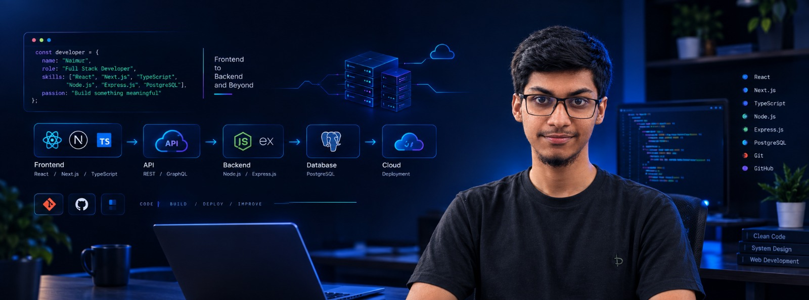

<h1 align="center">Hi 👋, I'm Naimur Rahman</h1>

  

## 👋 About Me

- 👋 Hi, I'm Naimur
- 💻 I'm currently learning Full-Stack Web Development
- ⚛️ Working with React.js, Next.js and TypeScript
- 🖥️ Exploring Node.js, Express.js and REST APIs
- 🗄️ Learning MongoDB and PostgreSQL
- 🚀 Building real-world web applications
- 🌱 Currently improving my JavaScript and TypeScript skills
- 💼 Interested in Freelancing and Remote Opportunities
- 🎯 My goal is to become a Professional Full-Stack Developer

 

## 🌐 Connect With Me

  

  

 

## 🛠️ Technology Stack

### Languages

### Frontend

### Backend

### Database

### Tools & Technologies

### Authentication & ORM
- Better Auth
- Mongoose

### AI Engineering
- AI-Assisted Coding
- AI Mindset & Engineering

 

## 📊 GitHub Statistics

<!-- 

  

 -->

 

  

